# SentinelQuant — Detailed User Journey Architecture (9 Modules)

This diagram maps the user's experience to **9 Distinct System Modules**, ensuring a comprehensive view of the system's internal workings.

```mermaid
graph TD
    %% ─── STYLES ───
    classDef client fill:#e0e7ff,stroke:#4f46e5,color:#312e81;
    classDef api fill:#f3e8ff,stroke:#9333ea,color:#581c87;
    classDef secure fill:#fee2e2,stroke:#dc2626,color:#7f1d1d;
    classDef ingest fill:#dbeafe,stroke:#2563eb,color:#1e3a8a;
    classDef process fill:#ccfbf1,stroke:#0d9488,color:#115e59;
    classDef ai fill:#fce7f3,stroke:#db2777,color:#831843;
    classDef quant fill:#dcfce7,stroke:#16a34a,color:#14532d;
    classDef trade fill:#ffedd5,stroke:#ea580c,color:#7c2d12;
    classDef db fill:#f1f5f9,stroke:#475569,color:#0f172a;

    %% ─── MODULE DEFINITIONS ───

    subgraph M1 ["1. Client Interface Module"]
        UI_Login["Login Page"]
        UI_Dash["Dashboard"]
        UI_Controls["Control Panel"]
    end
    class UI_Login,UI_Dash,UI_Controls client;

    subgraph M2 ["2. API Gateway Module"]
        Router["Express Router"]
        Response["Response Handler"]
    end
    class Router,Response api;

    subgraph M3 ["3. Security & Auth Module"]
        JWT["JWT Validator"]
        RBAC["Role Checker"]
    end
    class JWT,RBAC secure;

    subgraph M4 ["4. Data Ingestion Module"]
        Scraper["News Scraper Engine"]
        Fetcher["HTTP Client"]
    end
    class Scraper,Fetcher ingest;

    subgraph M5 ["5. Preprocessing Module"]
        Cleaner["HTML Sanitizer"]
        EntityLink["Stock Entity Detector"]
    end
    class Cleaner,EntityLink process;

    subgraph M6 ["6. Sentiment Intelligence Module"]
        FinBERT["FinBERT Model"]
        Decay["Time-Decay Engine"]
    end
    class FinBERT,Decay ai;

    subgraph M7 ["7. Portfolio Quant Module"]
        WeightCalc["60/40 Allocator"]
        Rebalancer["Rebalance Logic"]
    end
    class WeightCalc,Rebalancer quant;

    subgraph M8 ["8. Trade Execution Module"]
        OrderGen["Order Generator"]
        TxLog["Transaction Logger"]
    end
    class OrderGen,TxLog trade;

    subgraph M9 ["9. Persistence Module"]
        DB[("PostgreSQL Database")]
    end
    class DB db;

    %% ─── USER JOURNEY FLOW ───

    %% Journey 1: Authentication
    UI_Login -->|"1. Credentials"| Router
    Router -->|"2. Verify"| JWT
    JWT <-->|"Check User"| DB
    JWT -->|"3. Issue Token"| UI_Login

    %% Journey 2: Data Refresh (Background)
    UI_Controls -->|"4. Trigger Scrape"| Router
    Router -->|"5. Auth Check"| RBAC
    RBAC --> Scraper
    Scraper --> Fetcher
    Fetcher -->|"6. Raw HTML"| Cleaner
    Cleaner --> EntityLink
    EntityLink -->|"7. Clean Text"| FinBERT
    FinBERT -->|"8. AI Score"| Decay
    Decay -->|"9. Save Data"| DB

    %% Journey 3: Portfolio Action
    UI_Dash -->|"10. View Portfolio"| Router
    Router --> WeightCalc
    WeightCalc <-->|"11. Fetch Sentiment"| DB
    WeightCalc --> Rebalancer
    Rebalancer -->|"12. Buying Signs"| OrderGen
    OrderGen --> TxLog
    TxLog -->|"13. Commit Trade"| DB
    DB --> Response
    Response -->|"14. Updated View"| UI_Dash

```

---

## 🗺️ Journey Breakdown by Module

### 🔐 Phase 1: Security (Modules 1, 2, 3)
1.  **User** interacts with **Module 1 (Client)** to Login.
2.  Request hits **Module 2 (API Gateway)**.
3.  **Module 3 (Security)** validates credentials against **Module 9 (DB)** and issues a secure token.

### 🕷️ Phase 2: Ingestion & Intelligence (Modules 4, 5, 6)
*   *Triggered by Admin or Scheduler*
1.  **Module 4 (Ingestion)** fetches raw articles from the web.
2.  **Module 5 (Preprocessing)** cleans HTML and links "Apple" to "AAPL".
3.  **Module 6 (Intelligence)** uses FinBERT to score sentiment (-1 to +1) and applies Time Decay.
4.  Result is stored in **Module 9 (DB)**.

### 📈 Phase 3: Quantification & Trading (Modules 7, 8)
1.  **Module 7 (Quant)** reads the latest sentiment scores from DB.
2.  It applies the **60/40 Strategy** to calculate target weights.
3.  **Module 8 (Trade Execution)** compares Tarvet vs Current.
4.  If different, it generates **Buy/Sell Orders** and logs them to **Module 9 (DB)**.
