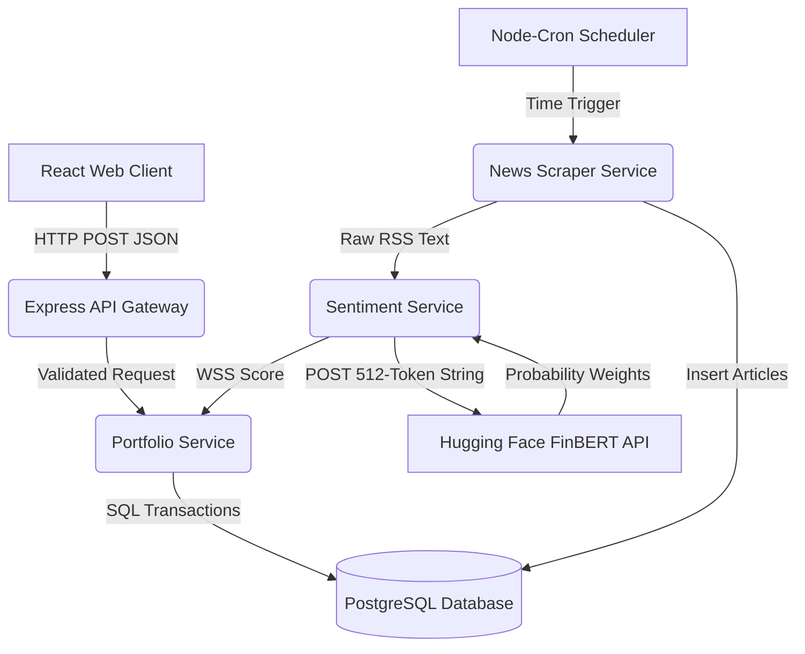
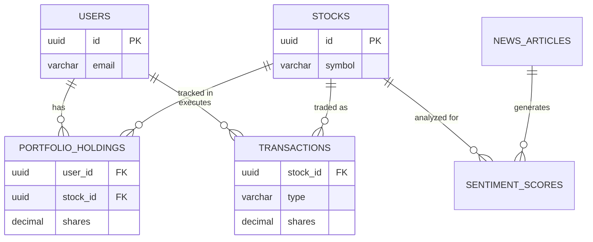
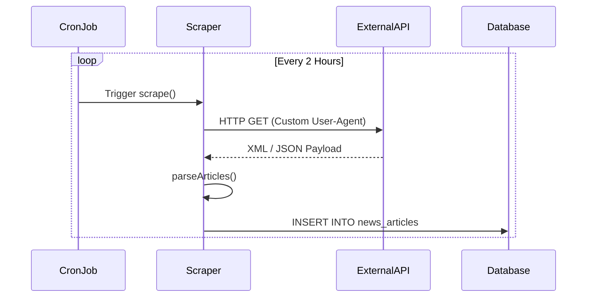
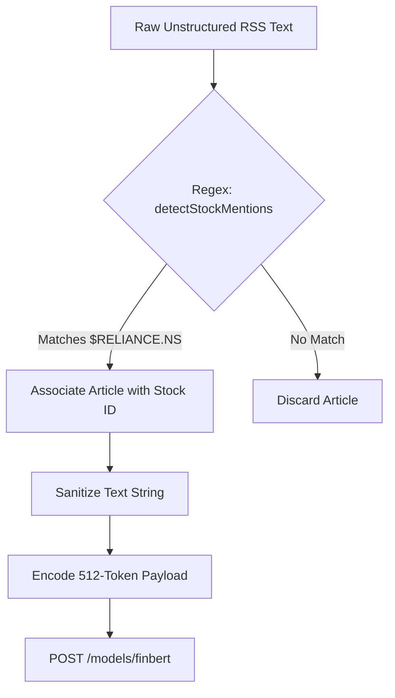
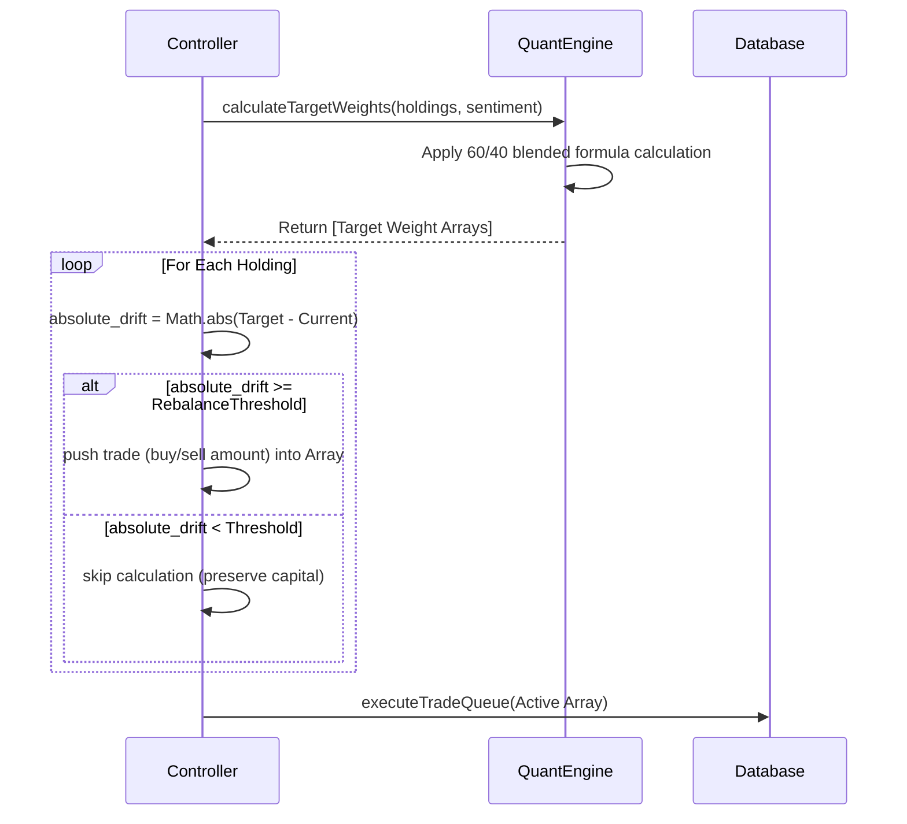
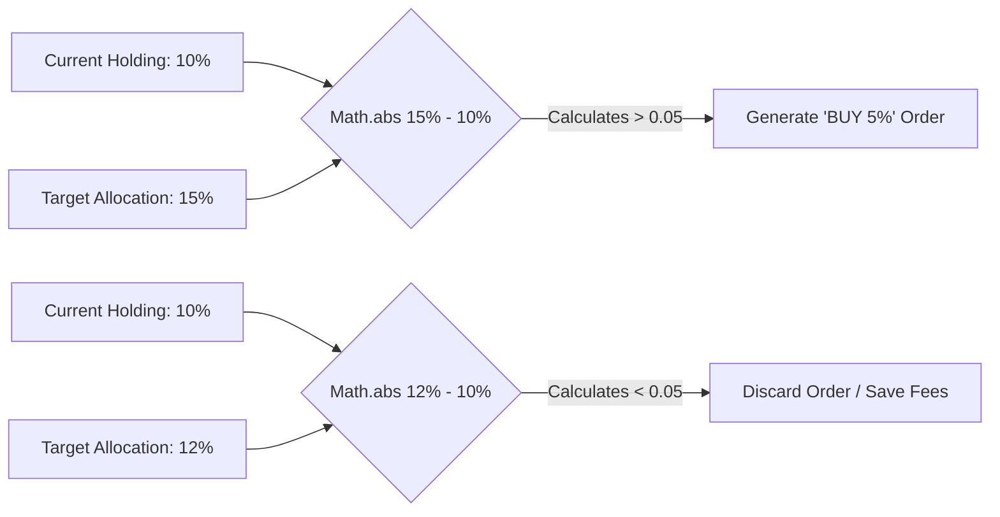
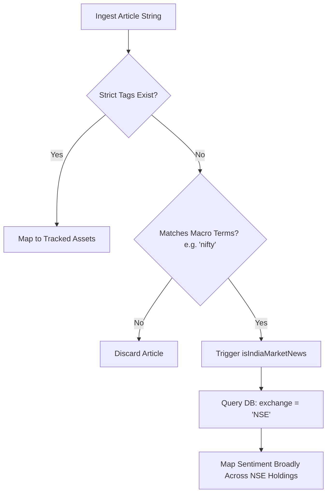
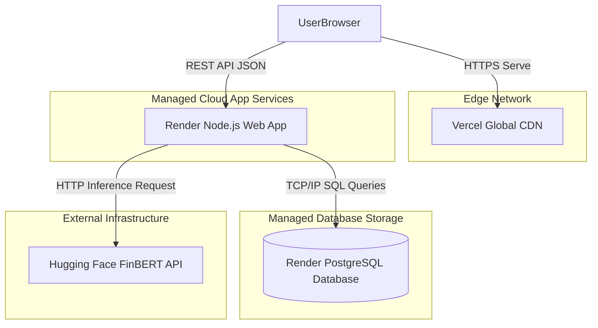

# SentinelQuant: AI-Driven Sentiment Portfolio System
## Academic Defense Deck (V3)

---

### Slide 1: Project Front Page
**Project Title:** SentinelQuant: AI-Driven Sentiment Portfolio System
**Project Domain:** FinTech / AI Quantitative Finance / Natural Language Processing
**Project Guide:** [Insert Guide Name Placeholder]
**Team Members:** 
- [Insert Name 1] (Reg. No: [Insert Reg No Placeholder])
- [Insert Name 2] (Reg. No: [Insert Reg No Placeholder])
- [Insert Name 3] (Reg. No: [Insert Reg No Placeholder])
- [Insert Name 4] (Reg. No: [Insert Reg No Placeholder])
**Institution:** [Insert College/University Name Placeholder]

*(Code Anchors: `client/src/App.jsx`, `server/services/sentimentService.js`)*

---

### Slide 2: Introduction
**System Overview:**
SentinelQuant is a full-stack Web Application that actively manages a simulated stock portfolio using Natural Language Processing. It replaces traditional technical indicators with programmatic evaluations of global financial news events.

**High-Level Pipeline:**
1. **Ingest:** Background schedulers fetch the latest news dynamically via RSS and REST APIs.
2. **Analyze:** Texts are evaluated via the `ProsusAI/finbert` Hugging Face Inference API.
3. **Rebalance:** A computed Weighted Sentiment Score (WSS) algorithmically triggers capital allocation shifts across user holdings.

*(Code Anchors: `README.md`, `server/cron.js`)*
*(Visual Requirement: 3-block intro graphic: Ingest → Analyze → Rebalance)*

---

### Slide 3: Problem Statement
Retail algorithmic execution lacks robust sentiment integration due to three documented challenges:
1. **Information Overload:** Retail traders lack infrastructure to computationally process daily financial media volume.
2. **Reaction Delay:** Price adjustments occur rapidly post-publication; manual evaluation is insufficiently paced.
3. **Emotional Bias:** Subjective human interaction introduces hesitation, violating strict risk-management parameters.

*(Code Anchor: `server/scrapers/newsScraper.js`)*
*(Visual Requirement: Problem-impact infographic highlighting Overload, Delay, and Bias)*

---

### Slide 4: Project Objectives
- **Live Ingestion:** Maintain reliable RSS/API polling for explicit financial instruments.
- **NLP Scoring:** Generate probabilistic sentiment weights utilizing a pre-trained financial domain model.
- **WSS Generation:** Implement elapsed-time decay algorithms to prioritize recent data.
- **Dynamic Rebalancing:** Execute quantitative Target Drift transactions contingent on a configured threshold (e.g., 5%).
- **Dashboard Transparency:** Provide active visualization of ledger actions and API responses.

*(Code Anchors: `server/services/portfolioService.js`, `server/services/sentimentService.js`)*
*(Visual Requirement: Objective checklist with measurable outcomes)*

---

### Slide 5: Purpose and Need of the Project
- **User Perspective:** Democratize quantitative workflows by substituting subjective decision-making with deterministic algorithms.
- **Technical Perspective:** Integrate asynchronous machine learning inference pipelines effectively with standard relational persistence layers.
- **Academic Perspective:** Demonstrate structural component coupling within a contemporary Client-Server Architecture.

*(Code Anchor: `README.md`)*
*(Visual Requirement: Purpose pyramid diagram detailing User, Technical, and Academic tiers)*

---

### Slide 6: Scope of the Project
**In-Scope:**
- Automated parsing of specified financial news RSS and HTTP endpoints.
- Support for mapping global news entities to specific domestic (NSE) and US market identifiers.
- State simulation tracking for abstract portfolio holdings and associated ledgers.

**Out-of-Scope Constraints:**
- **Live Brokerage Execution:** The system calculates target drift but explicitly does not issue live capital orders to brokerages (e.g., Zerodha, Alpaca).

*(Code Anchors: `server/scrapers/newsScraper.js`, `server/services/sentimentService.js`)*
*(Visual Requirement: In-scope vs. Out-of-scope two-column comparative slide)*

---

### Slide 7: Social Relevance & SDGs Addressed
**Macro Impact:** Accessible algorithmic transparency promotes financial literacy by demonstrating deterministic market reactions to media narratives.

**SDG Mapping:**
- **SDG 8 (Decent Work & Economic Growth):** Promotes informed, objective financial planning strategies free of subjective bias.
- **SDG 9 (Industry, Innovation, & Infrastructure):** Exhibits the architectural approach required to integrate external ML inference into standard Web API gateways.

*(Visual Requirement: SDG block mapping with explicit short-sentence evidence captions)*

---

### Slide 8: Software Requirement Specification (SRS)
**Platform Environment:**
- **Frontend Architecture:** React (Vite environment).
- **Backend Architecture:** Node.js API (CommonJS Modules).
- **RDBMS:** PostgreSQL.

**Primary Stakeholders:**
- **End User:** Interacts with the Dashboard, uploads `.csv` holdings, triggers manual previews.
- **System Maintainer:** Governs environment configurations and database migrations.

*(Code Anchor: `server/index.js`, `client/package.json`)*
*(Visual Requirement: SRS Context Box alongside Stakeholder matrix)*

---

### Slide 8.1: Functional Requirements
| FR-ID | Requirement Statement | Code Anchor |
|---|---|---|
| **FR-01 (Auth)** | System must process JWT generation and validation for authenticated users. | `server/routes/auth.js` |
| **FR-02 (Ingest)** | Background workers must parse configured RSS/API endpoints into structured memory arrays. | `newsScraper.js` |
| **FR-03 (Score)** | System must transmit sanitized strings to FinBERT and record resultant probabilistic weight. | `sentimentService.js` |
| **FR-04 (Import)** | UI must parse `.csv` byte arrays into recognizable JSON holding structures. | `Portfolio.jsx` |
| **FR-05 (Rebalance)** | Quant engine must compare current holds to target metrics and compute transactional drift. | `portfolioService.js` |

*(Visual Requirement: FR table mapping ID, statement, and explicit routing module)*

---

### Slide 8.2: Non-Functional Requirements
| NFR-ID | Constraint Statement | Code Anchor |
|---|---|---|
| **NFR-A (Resilience)** | API must handle HTTP 429 and 503 inference delays via exponential or delayed retry loops. | `sentimentService.js` |
| **NFR-B (Security)** | Authorization protocols must govern API endpoints preventing unauthorized user payload execution. | `middleware/auth.js` |
| **NFR-C (ACID)** | Simulated trades must update holding records and transaction ledgers within isolated SQL transactions. | `db/index.js` |
| **NFR-D (Config)** | Core execution parameters (`MAX_POSITION_PERCENT`) must be injected via `.env`, avoiding code constants. | `.env` variables |

*(Visual Requirement: NFR table mapping constraints strictly to architectural decisions and explicit files)*

---

### Slide 9: System Architecture (Block Diagram)
*(Presenter guides architecture flow)*
Execution initiates via Web UI actions or internal Cron schedules. Express API Routers validate authentication state before offloading request handling to Service modules. NLP data generation relies strictly on outbound HTTP calls to Hugging Face infrastructure. Validated application state is persisted across normalized PostgreSQL tables leveraging pooled connections.



*(Code Anchors: `server/index.js`, `server/cron.js`)*

---

### Slide 10: Application Architecture Design (9-Module Decomposition)
Architecture enforces distinct boundary contexts to mitigate tight coupling:

```mermaid
flowchart TD
    %% Define Styles
    classDef ui fill:#4a5568,stroke:#2d3748,color:#fff
    classDef gateway fill:#805ad5,stroke:#553c9a,color:#fff
    classDef security fill:#e53e3e,stroke:#9b2c2c,color:#fff
    classDef ingest fill:#3182ce,stroke:#2b6cb0,color:#fff
    classDef nlp fill:#38a169,stroke:#276749,color:#fff
    classDef db fill:#edf2f7,stroke:#a0aec0,color:#1a202c
    
    subgraph Client Interface Module
        CP[1. Credentials]
        LP(Login Page) ::: ui
        DB(Dashboard) ::: ui
    end
    
    subgraph API Gateway Module
        ER(Express Router) ::: gateway
        RH(Response Handler) ::: gateway
    end
    
    subgraph Security Module
        JWT(JWT Validator) ::: security
    end
    
    subgraph Data Ingestion Module
        NS(News Scraper Engine) ::: ingest
        HC(HTTP Client) ::: ingest
    end
    
    subgraph Preprocessing Module
        HS(HTML Sanitizer) ::: nlp
        SE(Stock Entity Detector) ::: nlp
    end
    
    subgraph Sentiment Intelligence Module
        FB(FinBERT Model) ::: security
        TD(Time-Decay Engine) ::: security
    end
    
    subgraph Portfolio Quant Module
        AA(60/40 Allocator) ::: nlp
        RL(Rebalance Logic) ::: nlp
    end
    
    subgraph Trade Execution Module
        OG(Order Generator) ::: gateway
        TL(Transaction Logger) ::: gateway
    end
    
    subgraph Persistence Module
        DB_SQL[(PostgreSQL Database)]:::db
    end

    %% Auth Flow
    CP -->|1. Submit| LP
    LP -->|2. POST| ER
    ER -->|3. Verify| JWT
    JWT -->|4. Issue Token| LP
    
    %% Ingestion Flow (Automated)
    NS -->|5. Cron Trigger| HC
    HC -->|6. Raw HTML| HS
    HS -->|7. Clean Text| SE
    SE -->|8. Parsed Target| FB
    FB -->|9. AI Score| TD
    TD -->|10. Save WSS| DB_SQL

    %% Quant Flow (Client Triggered rebalance)
    DB -->|11. Trigger Rebalance| ER
    ER -->|12. Auth Check| JWT
    JWT -->|13. Fetch Sentiment| AA
    AA -->|14. Target Weight| RL
    RL -->|15. Buying Signs| OG
    OG -->|16. Commit Log| TL
    TL -->|17. Save Trade| DB_SQL
    DB_SQL -->|18. Return State| RH
    RH -->|19. Updated View| DB

```

*(Code Anchor: `Current_User_Journey_Map.md`)*

---

### Slide 11: GUI Design
The frontend UI enforces modular React state management independent of rigid global stores where possible.
- **Dashboard (`Dashboard.jsx`):** Renders interactive allocations employing `Recharts` SVG computations.
- **Sentiment Grids (`MagicBento`):** Visual indicators linking FinBERT scoring data directly to localized CSS variables.
- **Forms (`Portfolio.jsx`):** Modal overlays handling localized user input parsing before executing asynchronous network calls. 

*(Code Anchors: `Dashboard.jsx`, `Portfolio.jsx`)*
*(Visual Requirement: Mockup board utilizing real screenshots with labeled functional callouts)*

---

### Slide 12: API Design 
The backend exposes isolated REST endpoints utilizing JSON payload conventions.

**Auth Flow & Endpoints:**
- Client submits credentials → API evaluates Bcrypt Hash → API replies with signed Bearer JWT (Default `.env` expiry: 7 Days).
- **Core Endpoints:**
  - `POST /api/portfolio/import` (Processes CSV Data)
  - `POST /api/portfolio/rebalance` (Computes drift transactions)
  - `GET /api/stocks/search` (Performs database similarity lookup)

*(Code Anchors: `server/index.js`, `postman_collection.json`, `client/src/utils/api.js`)*
*(Visual Requirement: API contract table + Auth sequence mini-diagram)*

---

### Slide 13: Database Design
Normalized RDBMS schemas ensure data integrity over simple document-store flexibility.


*(Code Anchor: `server/db/migrate.js`)*

---

### Slide 14: Technology Stack
- **Frontend Presentation:** React 19, Vite, Recharts.
- **Backend Application:** Node.js 18 (CommonJS), Express, `node-cron`.
- **Database Persistence:** PostgreSQL 14+, accessed utilizing the native `pg` driver module.
- **Machine Learning Integration:** Direct HTTP protocol calls leveraging `Hugging Face Inference API`.
- **Security Protocols:** `Helmet` CSP, `express-rate-limit`, `bcryptjs`, and JSON Web Tokens.

*(Code Anchors: Frontend and Backend `package.json`)*
*(Visual Requirement: Layered stacked chart delineating Frontend, Backend, Database, and ML boundaries)*

---

### Slide 15: Module Use Case (M1/M2) - Client API Interaction
**Focus:** User Payload Submission.

```mermaid
sequenceDiagram
    actor End User
    participant App Component
    participant API Gateway
    participant Portfolio Router
    
    End User->>App Component: Uploads Holdings CSV
    App Component->>App Component: parseHoldingsCsv() (Sanitize)
    App Component->>API Gateway: POST /api/portfolio/import [JSON]
    API Gateway->>API Gateway: Rate Limit & Validate JWT
    API Gateway->>Portfolio Router: Route sanitized request
    Portfolio Router-->>App Component: 200 OK {imported, rejected}
    App Component-->>End User: Render updated Portfolio DOM
```
*(Code Anchors: `client/src/pages/Portfolio.jsx`, `server/routes/portfolio.js`)*

---

### Slide 16: Module Use Case (M3/M4) - Cron to Ingestion Orchestration
**Focus:** Automating Document Fetch Limits.



*(Code Anchors: `server/cron.js`, `server/scrapers/newsScraper.js`)*
---

### Slide 17: Module Use Case (M5/M6) - Preprocessing to ML Inference
**Focus:** Unstructured Text Validation.



*(Code Anchors: `server/scrapers/newsScraper.js`, `server/services/sentimentService.js`)*

---

### Slide 18: Module Use Case (M7/M8) - Quant Target to Execution
**Focus:** The Rebalancing Evaluation.


*(Code Anchor: `server/services/portfolioService.js`)*

---

### Slide 19: Module Use Case (M9) - ACID DB Persistence
**Focus:** Protecting State Integrity.

```mermaid
flowchart TD
    Start((Execute Trade Queue)) --> B[pool.connect()]
    B --> C[SQL: BEGIN;]
    
    C --> D{Query 1: UPDATE portfolio_holdings}
    D -->|Promise Resolved| E{Query 2: INSERT transactions}
    D -->|Promise Rejected| F[SQL: ROLLBACK;]
    
    E -->|Promise Resolved| G[SQL: COMMIT;]
    E -->|Promise Rejected| F
    
    G --> H((Return 200 OK))
    F --> I((Throw 500 Error))
```

*(Code Anchors: `server/db/index.js`, `server/services/portfolioService.js`)*

---

### Slide 20: Algorithm 1 - FinBERT Raw Score
**Mathematical Logic (`calculateRawScore`):**
The external model returns probabilistic arrays `[P_positive, P_negative, P_neutral]`.
- **Formula applied:** `Score = (P_pos - P_neg) * (1 - P_neu * 0.5)`
- **Evaluation:** Decreases resultant target thresholds if sentence neutrality is high, enforcing trading action exclusively upon highly polarizing data markers.

*(Code Anchor: `server/services/sentimentService.js`)*
*(Visual Requirement: Formula box adjacent to an evaluated sample text parsing output)*

---

### Slide 21: Algorithm 2 - Exponential Time Decay
**Mathematical Logic:**
Financial market latency requires depreciating outdated data points from computing arrays quickly.
- **Formula applied:** `Weight = Math.exp(-Target_Hours / Constant_Decay_Factor)`
- **Evaluation:** Evaluates data upon a negative exponential curve, ensuring identical headlines yield vastly different weight calculations depending strictly upon `UnixTimestamp` variables.

*(Code Anchor: `server/services/sentimentService.js`)*
*(Visual Requirement: Decay curve chart depicting 24-hr and 48-hr drops)*

---

### Slide 22: Algorithm 3 - WSS Normalization
**Mathematical Logic:**
Mitigating raw publication volume variations across disparate tracked equities.
- **Formula applied:** `WSS = sum(Raw * Decayed_Weight) / sum(Decayed_Weight)`
- **Evaluation:** Yields a normalized bounded variable precisely locked between `[-1.0, 1.0]` regardless of source ingestion frequency volumes.

*(Code Anchor: `server/services/sentimentService.js`)*
*(Visual Requirement: Weighted average tabular breakdown example)*

---

### Slide 23: Algorithm 4 - 60/40 Target Allocation
**Mathematical Logic (`calculateTargetWeights`):**
Determining risk bounds restricting pure sentiment over-exposure scenarios.
- **Formula applied:** `Target = (0.6 * Calculated_Sentiment) + (0.4 * Total_Equal_Coverage)`
- **Evaluation:** Fuses dynamic neural-net scoring mechanisms against strict Equal-Weight constants yielding a diversified array configuration bounded additionally by `.env` defined maxima.

*(Code Anchor: `server/services/portfolioService.js`)*
*(Visual Requirement: Allocation formula output resolving a Sample Array Table)*

---

### Slide 24: Algorithm 5 - Rebalance Trigger Logic
**Mathematical Logic:**
Limiting execution noise against marginal point volatility.



*(Code Anchor: `server/services/portfolioService.js`)*

---

### Slide 25: Procedure - Entity Extraction and Fallback
**Mapping Unstructured Regional Logic (`isIndiaMarketNews`)**



*(Code Anchors: `server/scrapers/newsScraper.js`, `server/services/sentimentService.js`)*

---

### Slide 26: Coding Standards & Repository Practices
- **Backend Definition:** Nodes rely explicitly upon synchronous/asynchronous **CommonJS** logic boundaries (`require`). 
- **Frontend Definition:** SPA enforces functional component evaluation utilizing React Hooks structures within strict ES6 variable contexts.
- **Configuration Security:** Absolute abstraction of cryptographic keys and percentage constants injected via isolated `.env` root definition files dynamically.

*(Code Anchors: `.env.example`, `.gitignore`, `client/eslint.config.js`)*
*(Visual Requirement: Setup checklist noting module styles and branch tracking limits)*

---

### Slide 27: Unit Test Design & Functional Validation
**Validation Methodology:** Isolated Component targeting. 
- Core math formulas (`calculateTargetWeights`) analyzed natively against rigid mock payload definitions verifying pure execution accuracy mathematically.
- UI elements (e.g. `MagicBento`) validated evaluating defined static CSS props independently assessing visual mapping parameters natively prior to server integration.

*(Code Anchors: `server/services/portfolioService.js`, Component configurations)*
*(Visual Requirement: Validated functions testing matrix highlighting verified math capabilities)*

---

### Slide 28: Integration Validation Testing
**Validation Methodology:** Postman API Routing assertions.

```mermaid
sequenceDiagram
    participant Postman
    participant ExpressRouter
    participant AuthMiddleware
    participant PostgresDB
    
    Postman->>ExpressRouter: POST /api/auth/login
    ExpressRouter->>PostgresDB: Validate bcrypt hash
    PostgresDB-->>ExpressRouter: Match OK
    ExpressRouter-->>Postman: 200 OK [Bearer JWT]
    
    Postman->>ExpressRouter: POST /api/portfolio/rebalance (Header: Bearer)
    ExpressRouter->>AuthMiddleware: verifyToken(JWT)
    AuthMiddleware-->>ExpressRouter: User UUID Validated
    ExpressRouter->>PostgresDB: BEGIN; UPDATE; COMMIT;
    ExpressRouter-->>Postman: 200 OK [JSON Trade Array Output]
```

*(Code Anchors: `server/routes/*`, `postman_collection.json`)*

---

### Slide 29: Functional UI Validation 
**Validation Methodology:** Explicit UI Sequence Runbooks.
- *Test Sequence A:* Generate Auth Context → Evaluate initial empty State responses tracking `isStrictDemoPortfolio` generation routines.
- *Test Sequence B:* Inject `.csv` arrays → Verify DOM update sequence overriding Dummy visual indicators natively loading explicit User arrays properly.

*(Code Anchors: `client/src/pages/Portfolio.jsx`, `Dashboard.jsx`)*
*(Visual Requirement: E2E scenario runbook table denoting executed action vs expected UI state output)*

---

### Slide 30: Load Evaluation & Application Constraints
**Architecture Control Variables:**
- Limits execution risk applying standard `express-rate-limit` variables.
- Incorporates recursive `setTimeout` iterations mapping external Model delays.

```mermaid
sequenceDiagram
    participant Background Process
    participant HuggingFace Cloud
    
    Background Process->>HuggingFace Cloud: POST /models/finbert (Batch JSON)
    HuggingFace Cloud-->>Background Process: 503 Model Loading (est: 15s delay)
    Background Process->>Background Process: setTimeout(retry, 15000 + padding)
    Note over Background Process: Event Loop unblocked; API responds freely
    Background Process->>HuggingFace Cloud: POST /models/finbert (Retry Execution)
    HuggingFace Cloud-->>Background Process: 200 OK [Scoring Floating Points]
```

*(Code Anchors: `server/index.js`, `server/services/sentimentService.js`)*

---

### Slide 31: Bug Resolution Log
**Documented Corrective Configurations:**
- **Issue:** Cold-start server queries targeting ML Container instances yielded 503 Rejections halting operations completely.
- **Validation Fix:** Abstracted external fetching natively mapping loops explicitly waiting on delayed Promise triggers recovering queries securely.
- **Issue:** Recharts framework yielded rendering errors parsing equivalent Zero values mathematically terminating `<Pie>` renders.
- **Validation Fix:** Assigned explicitly minute static visual values preventing SVG bounds computations failing.

*(Visual Requirement: Formal bug tracking matrix noting defect vs applied resolution variable)*

---

### Slide 32: Proposed Deployment Architecture
*(Future State Applicability Model)*



*(Code Anchors: `README.md`, `client/vite.config.js`)*

---

### Slide 33: Status of Development
**Project Velocity:** Core Pipeline Implemented; Process Validation continues. 
- **Component Contributions:**
  - **[Member 1]:** Focused architecture structuring; database module definitions and localized user constraints.
  - **[Member 2]:** Actively executed Component bounds mapping React Rechart logic variables exclusively.
  - **[Member 3]:** Focused Scraper HTTP integrations defining complex iteration delays securely.
  - **[Member 4]:** Engineered algorithmic math metrics mapping generic Inference values into deterministic Rebalance logic strings.

*(Visual Requirement: Project metric table associating specific subsystem logic elements against contributor boundaries)*

---

### Slide 34: Working Model Demo Flow
**Demonstration Script Parameter:**
1. Establish Context initializing localized Application UI states explicitly via valid Auth arrays locally. 
2. Execute Scraper parameters routing HTTP GET logs natively reviewing parsed Console data arrays.
3. Observe Inference nodes executing mathematically printing derived variables internally. 
4. Assess live Frontend Websocket / Fetch arrays altering UI SVG chart bounds tracking updated states precisely.
5. Execute 'Rebalance Target' mapping resulting explicitly executed Action Ledgers cleanly.

*(Code Anchors: `News.jsx`, `Dashboard.jsx`, `server/routes/portfolio.js`)*
*(Visual Requirement: Step execution script block highlighting exact action execution steps)*

---

### Slide 35: System Screenshots
*(Placeholder: Annotated screenshots detailing functional subsystem active states)*
- Render precise `Dashboard.jsx` execution states capturing live Recharts allocation models.
- Supply Terminal console execution outputs logging executed Cron scraping metrics actively evaluating neural inference output strings.
- Render explicit Database Table structures evaluating specific Buy/Sell transactional metrics natively.

*(Visual Requirement: Clean annotated image collage targeting execution evidence variables)*

---

### Slide 36: Estimated Academic Prototype Cost
Budget constraints strictly mapped utilizing Free-Tier Service Architectures:
- **Cloud Database (PostgreSQL):** Render managed Instances (`$0.00`)
- **Node Web Server Application:** Render managed limits (`$0.00`)
- **React Node Delivery CDN:** Vercel Hosting bounds (`$0.00`)
- **External AI Inference NLP:** Hugging Face Application boundaries (`$0.00`)
- **Estimated Baseline Projection:** **$0.00 USD / Monthly**

*(Visual Requirement: Tabular bounding chart reviewing service layers natively comparing pricing vectors)*

---

### Slide 37: Project Scheduling (12-Week Gantt Mapping)
- **Phase A (Base Data Analysis):** Structured NLP financial applicability research metrics. 
- **Phase B (Data Models / Gateway):** Wrote core Auth constraints linking internal PostgreSQL schemas strictly natively.
- **Phase C (Ingest Configuration):** Engineered `node-cron` scraper intervals wrapping active regex variables actively extracting ticker logic securely.
- **Phase D (Quant Architecture):** Constructed Time-decay vs Absolute Weight mathematical baseline computations smoothly securely. 
- **Phase E (Client UI Execution):** Formatted complex Vite environments rendering decoupled UI frameworks dynamically evaluating local metrics.
- **Phase F (Methodical Validations):** Addressed identified application limitations writing execution verification documentation smoothly strictly.

*(Visual Requirement: Gantt execution map spanning standard multi-phase boundaries smoothly natively)*

---

### Slide 38: Conclusion Summary
**Evaluation Parameters Met:**
The application architecture solidly maps the foundational capabilities to leverage independent ML Transformer endpoints securely natively yielding objective mathematical execution target vectors completely devoid of localized human interaction delays or emotional volatility metrics logically and reliably.

---

### Slide 39: Bibliography 
1. **ProsusAI Model Foundations:** Araci, Dogu. "FinBERT: Financial Sentiment Analysis with Pre-trained Language Models." *arXiv preprint arXiv:1908.10063 (2019).*
2. **React Functional Architecture:** Meta framework DOM logic capabilities & guidelines. 
3. **Database Relational Models:** PostgreSQL Global Documentation (Transaction boundaries & ACID guidelines).
4. **Node Server Routing:** Node Event Loop internal processing constraints definitions.
5. **Hugging Face Integrations:** External HTTP Inference protocol network guidelines array dynamically.
